
<h1 align="center">电子资源管理系统</h1>

## 简介
电子资源管理系统：支持角色分为管理员和用户；实现资源上传与管理、用户信息管理、资源分类和查询、评论与点赞等互动功能，界面简洁明了，便于高效操作。    --计算机毕业设计源码；毕设源码；java毕业设计源码

## 联系方式

<h3 align="center">获取完整代码与数据库文件 + 微信：deepguan QQ: 86050149 QQ群: 783742310</h3>

<h3 align="center">可帮忙远程部署 包运行成功！提供远程部署、修改代码、设计文档指导、代码讲解等服务！</h3>

## 功能介绍（完整见运行截图）
管理员：基本功能包括登录、注册和退出，主页提供导航栏、资源管理、用户管理、系统管理等模块。管理员可以进行资源的添加、修改、删除和收藏管理，以及用户账号的创建、权限分配和信息更新。管理界面简洁实用，方便管理员高效地进行电子资源的监督和调整。

用户：用户须先进行注册和登录操作，可在主页浏览和搜索电子资源。个人中心模块允许用户查看并更新个人信息，以及管理个人收藏的资源。用户可以参与资源的点赞、评论、音频视频播放及收藏操作，以便充分利用和管理平台提供的各种电子资源。

访客：无需注册即可进入系统页面，但功能访问受限。访客可浏览主页上的基本信息和简介视频。若想获取详细资源信息与互动功能，需注册成为用户以访问更多系统模块。这一设计促进了系统的安全性和有效用户管理。

系统：整个系统设计简约，强调不同角色的功能分配和界面的直观导航。通过提供专业的电子资源管理功能，如多媒体上传、资源分类、查询和日志管理，系统旨在优化电子资源的管理及用户体验，适合不同角色高效、便捷地完成任务。

## 运行截图
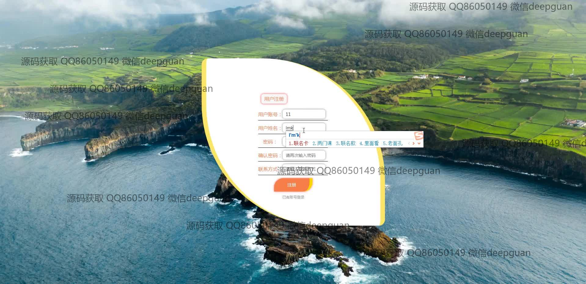
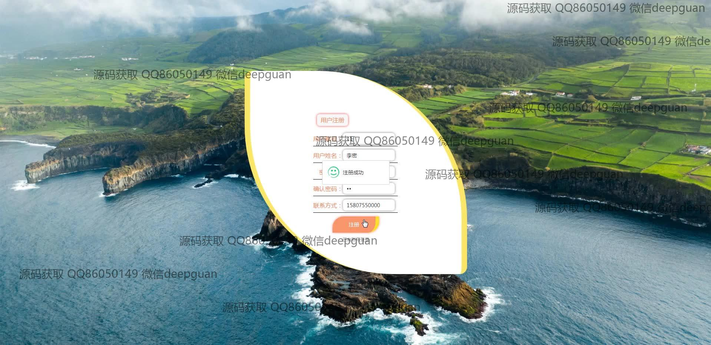
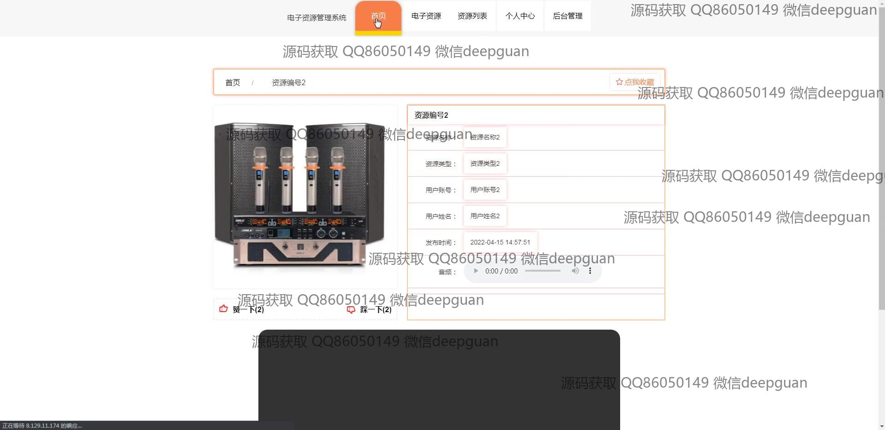
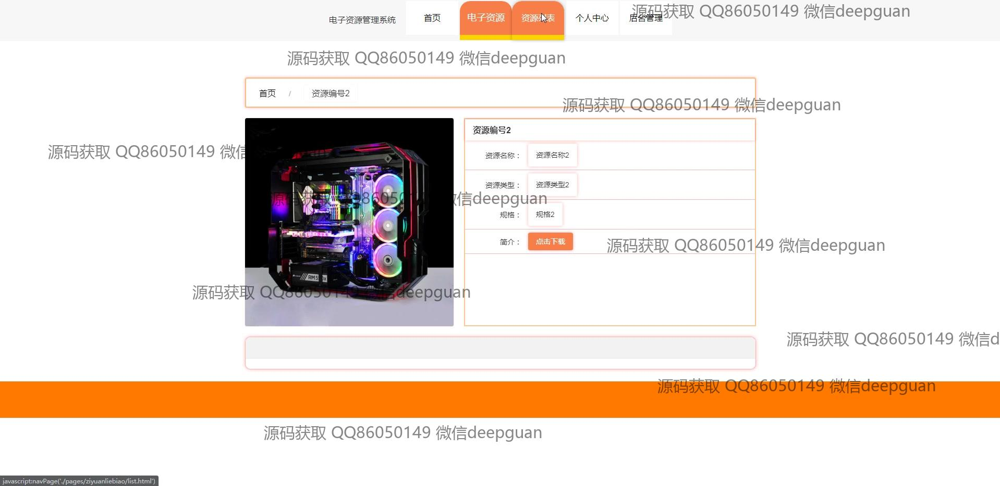
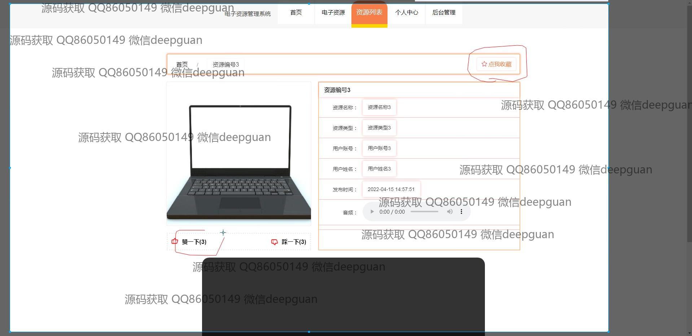
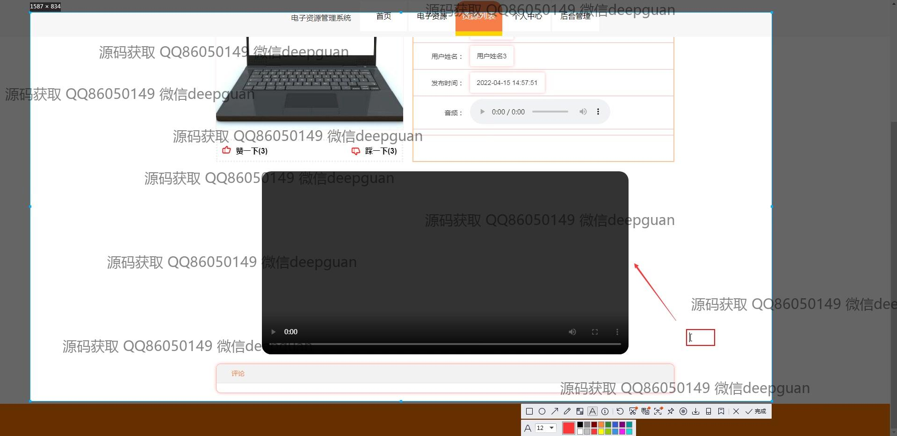
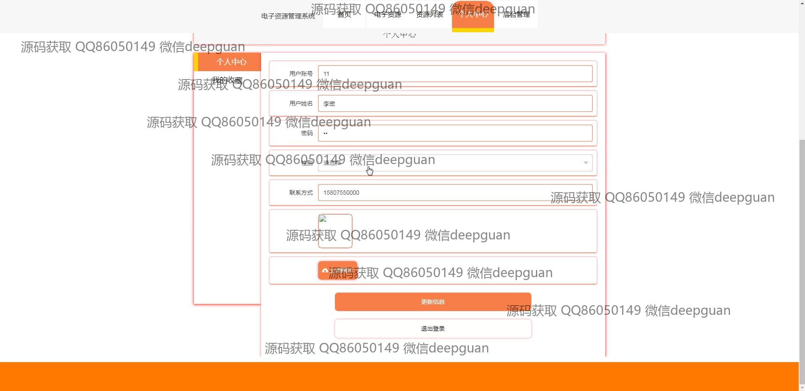
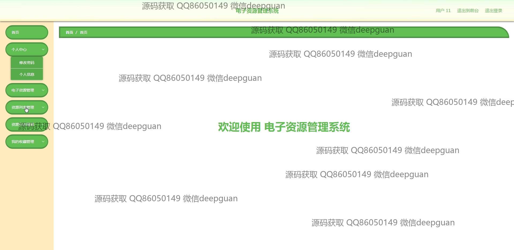
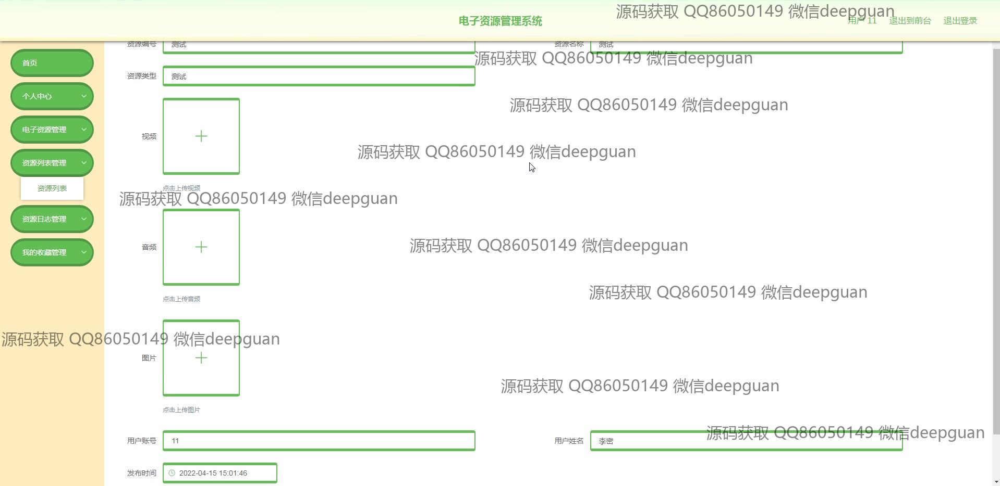
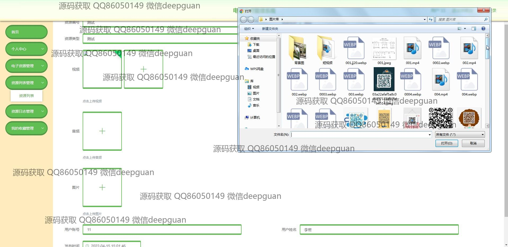

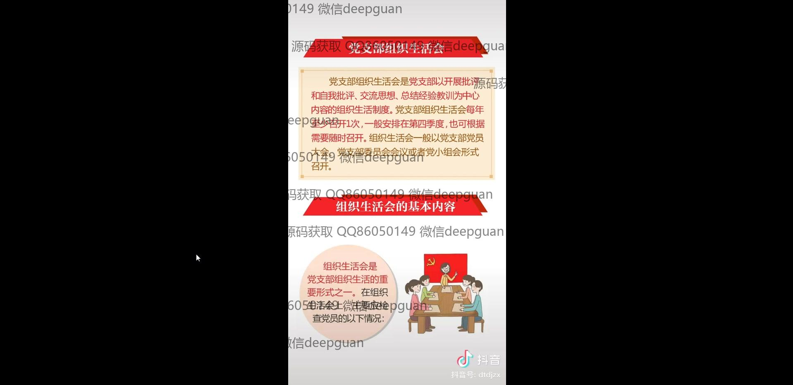
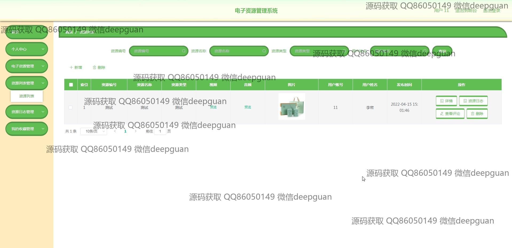
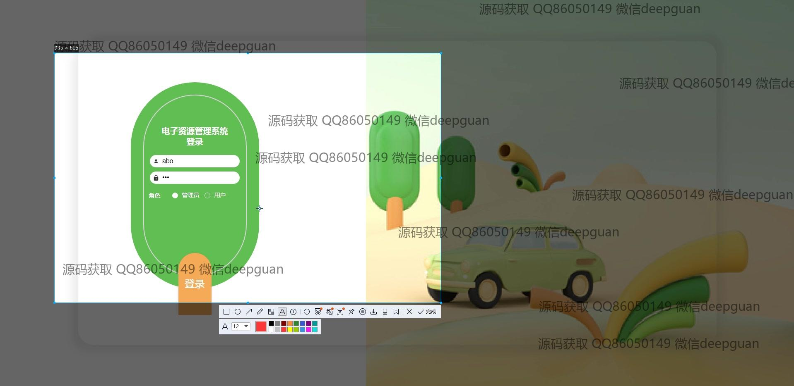
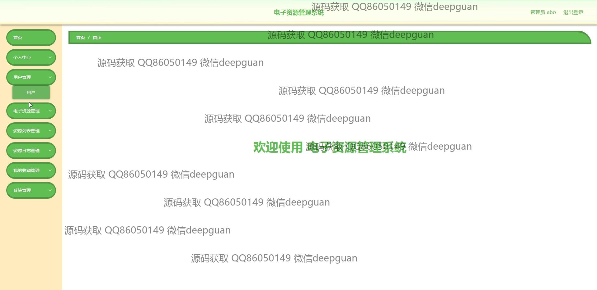
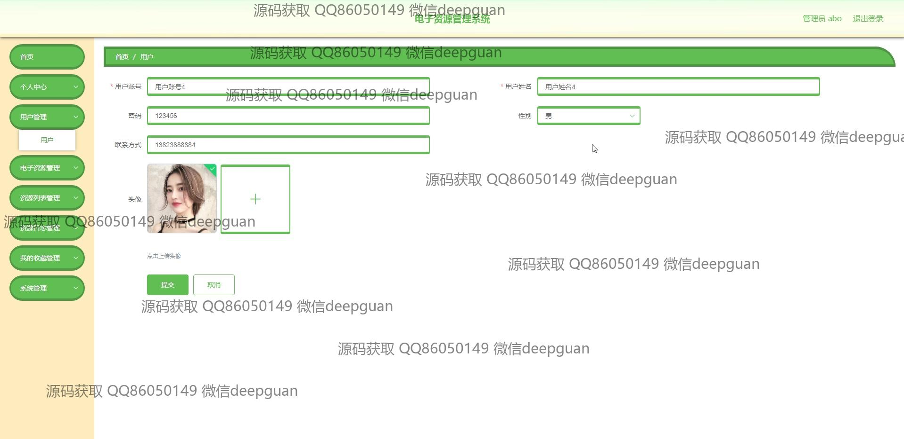
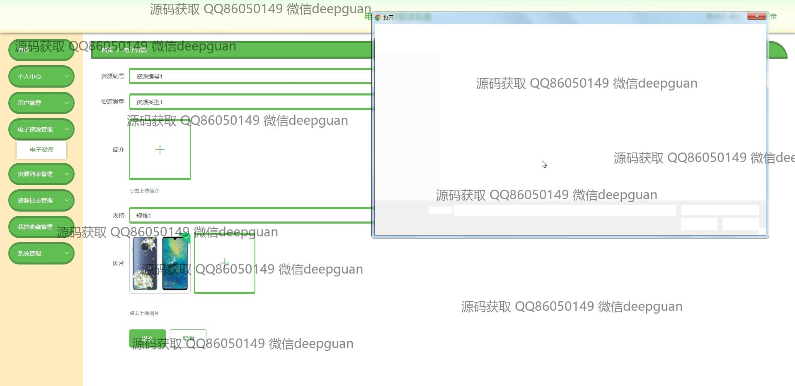
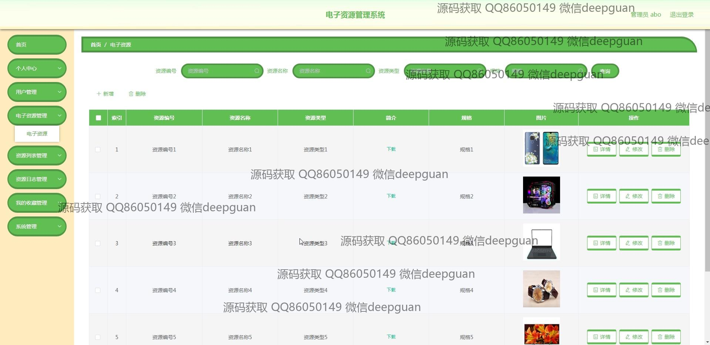
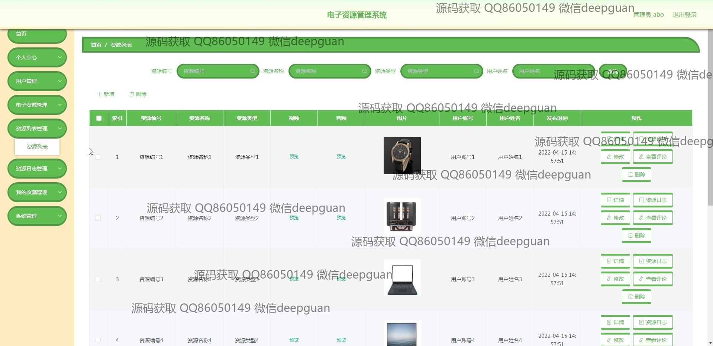
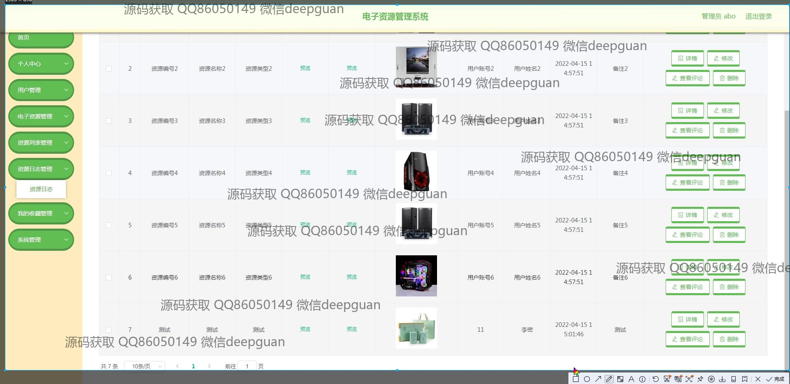
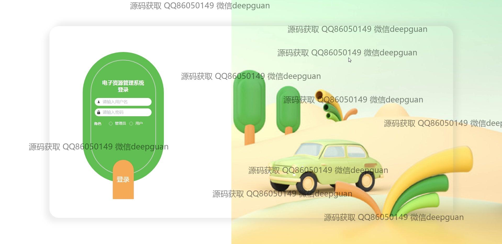

本代码来源于网络,仅供学习参考使用!

